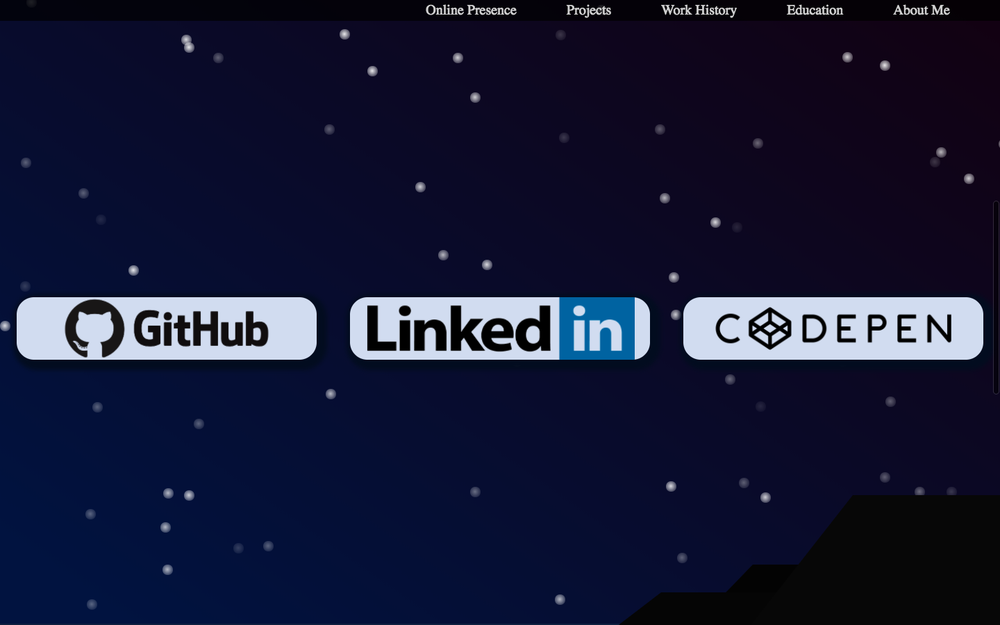
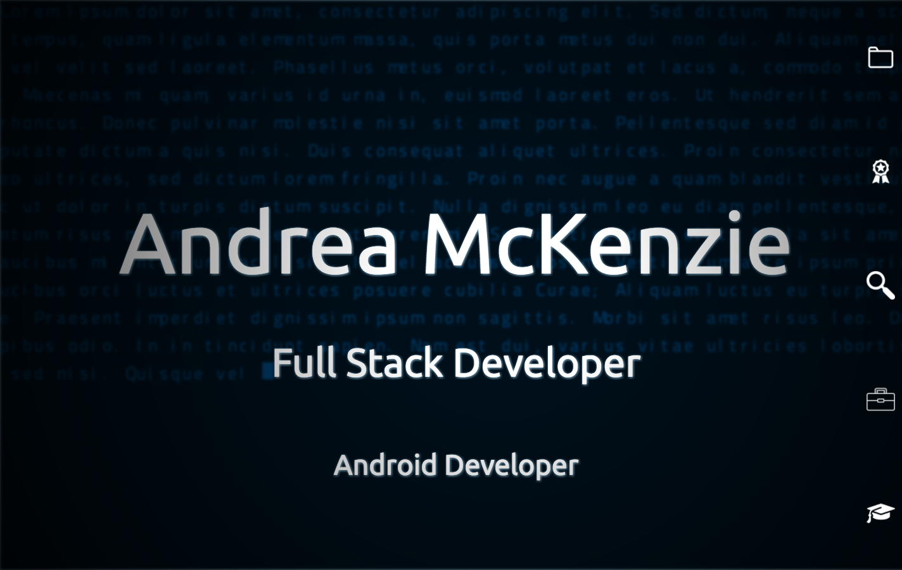

# Andrea McKenzie: Full Stack Developer
## An experiment into the limits of CSS3... And Andrea McKenzie
[Email](mailto:mckenzie.andrea.m@gmail.com) 
[LinkedIn](https://www.linkedin.com/in/andrea-mckenzie/)
[Skype](andrea-michelle-mckenzie)

------

## Please Note: My site is currently under construction. Please follow the links on the site to go directly to my Github or to see my resume. 

------

This is the first iteration of a combination resume and portfolio page for Andrea McKenzie, an up-and-coming full stack developer with experience in:
- Git and Group Git
- Ruby
- Ruby on Rails
- Java
- Javascript 
- PSQL
- Node.js
- Express.js
- React
- HTML 
and yes... CSS!

During her tutilage at [Per Scholas's](https://perscholas.org/) [#Codebridge](https://perscholas.org/apply/codebridge) program and at [General Assembly's](https://generalassemb.ly/) [Web Development Immersive](https://generalassemb.ly/education/web-development-immersive), Andrea came to excel in creative, inspired, responsive designs in her client-side designs while developing very thoroughly structured database schemas in her `Express.js` and `PSQL` applications. Prior to this formal education, Andrea graduated from [CUNY Hunter College]() *Cum Laude* with a Bachelors of Arts and was self-taught in `Ruby`,`Java`,and `Git` for two years. 

As a hobby, however, Andrea took up DOM manipulation and CSS tricks for designs and drawings. Each oage of her resume site is a different css drawing depicting a new scene or landscape. 

### Coming Soon!

